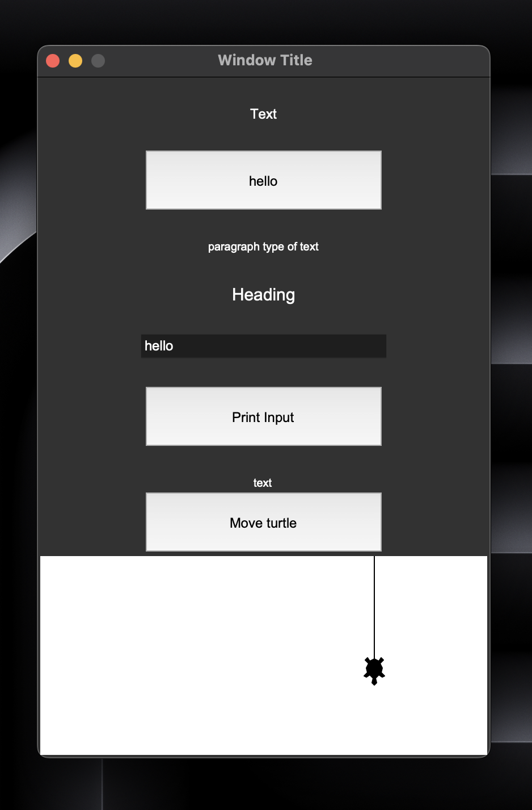

<picture>
  
</picture>

# AggmUI 

AggmUI is a module for creating sleek and modern user interfaces (UIs) in python, it uses the turtle and tkinter frameworks.

# Example UI

To learn more, check out these resources:

- [How AggmUI works](resources/how-it-works.md)
- [Examples](resources/examples.md)
